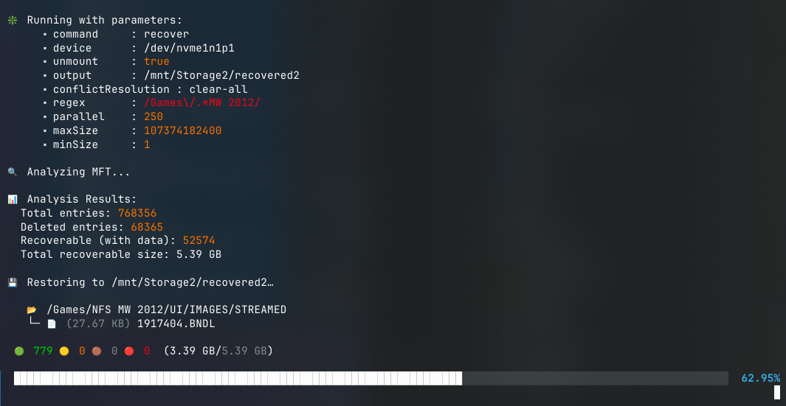
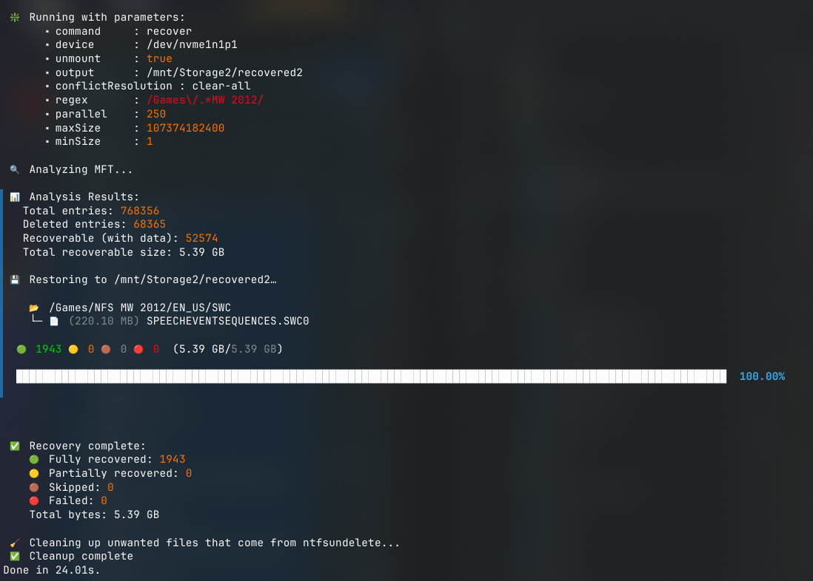
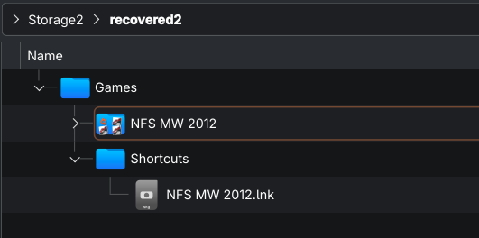

# UNWIND 
**_-the time back and recover your deleted files_**

[](LICENSE)
[](https://nodejs.org/)
[](https://www.typescriptlang.org/)
[](https://www.kernel.org/)

## 📸 Screenshots





## 💎 Features
- Rebuild folder tree structure using MFT references
  - unlike other apps that just dump everything in 1 folder (easy way)
- Parallel operations to save time (Restore multiple files at once)
- Selective recovery with regex
- Live progress tracking
 
## ✅ Requirements
- Linux based OS
  - Tested on Linux 6.17+ with Arch, KDE 6, Wayland
- Root access
- node + `npm`/`yarn`
- `ntfs-3g`
    - _includes `ntfsundelete` + `ntfsinfo`_
- NTFS Source device 
    - _(more may be supported in the future)_

## 🚀 Example usage
### Prepare:
- `git clone https://github.com/Galacticai/UNWIND`
- `cd UNWIND`
- `npm install`
### Run:
```bash
yarn start \
  recover \
  --device "/dev/sda1" \
  --output "/mnt/Storage/recovered" \
  --parallel 250 \ # good for nvme
  --regex "OnlyThisFolder/.*" \
  --unmount
```
### or just analyze:
```bash
yarn start analyze --device "/dev/sda1"
```

> ### Command options:
> - `-d, --device <path>` - Device path (required, e.g., `/dev/sda1`)
> - `-o, --output <path>` - Output directory for recovered files (required)
> - `-p, --parallel <number>` - Number of parallel recovery operations (default: `100`)
> - `-c, --conflictResolution <strategy>` - How to handle existing files (default: `replace-conflict`)
>   - `clear-all` - Remove all existing files in output before recovery
>   - `skip-conflict` - Skip files that already exist
>   - `replace-conflict` - Overwrite existing files
> - `-r, --regex <pattern>` - Filter file paths by regex pattern
> - `--maxSize <bytes>` - Maximum file size to recover (default: `107374182400` = 100GB)
> - `--minSize <bytes>` - Minimum file size to recover (default: `1` byte)
> - `--unmount` - Unmount device if currently mounted

## 🔧 How It Works

1. **MFT Analysis**
    - **Entry Parsing** - Extracts file metadata (name, size, parent directory, data runs) from MFT entries
2. **Tree Reconstruction** - Rebuilds directory structure using parent references defined by MFT entries
3. **Recovery Filtering**
4. **File Recovery** - with `ntfsundelete`
5. **Cleanup** - removes ntfs-3g unwanted artifacts
••• Please feel free to submit your ideas and contributions •••

••• ••• ••• •••

## ⚡ Performance Notes

- Increase `--parallel` on fast SSDs for better throughput
- Use `--regex` to filter specific directories/files instead of recovering everythig
- Use `--maxSize` to skip large files if disk space is limited
- Recovery speed depends on disk speed (and fragmentation if mechanical HDD)

## ▫️ General Notes
- Always backup your data so you don't need recovery utilities.
- In case of data loss, unmount the affected drive ASAP and don't modify its contents in order to ensure a high success rate in recovery
- UNWIND does not guarantee 100% validity for the recovered files, since deleted files can be overwritten by new data
